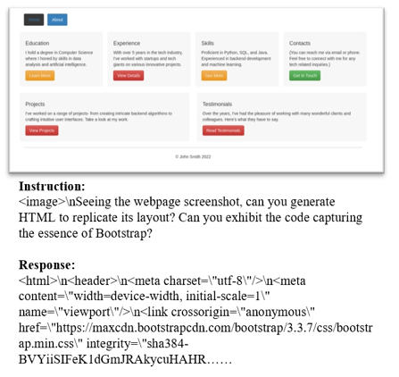
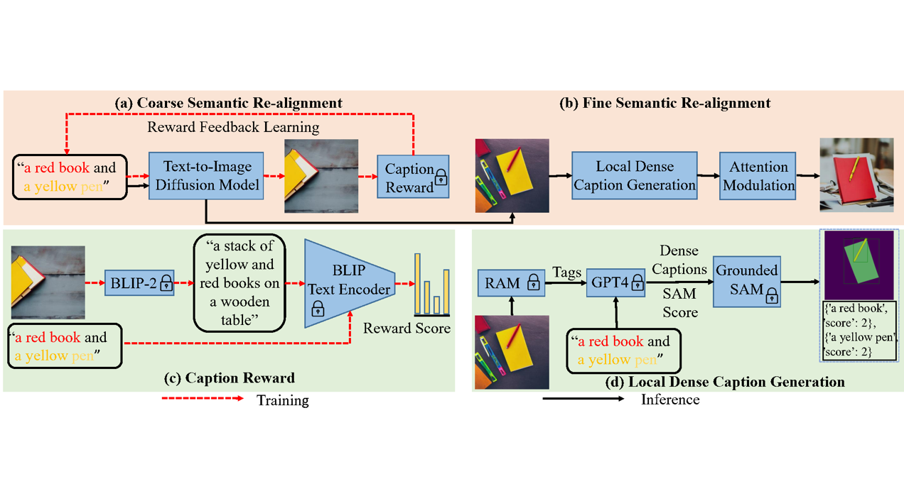

I am a postdoctoral researcher at <a href="https://mbzuai.ac.ae/">Mohamed bin Zayed University of Artificial Intelligence (MBZUAI)</a>, working with <a href="https://lemondan.github.io/">Prof. Xiaodan Liang</a>. Before that, I received my PhD at Xi’an Jiaotong University in March 2023, advised by  <a href="https://gr.xjtu.edu.cn/en/web/zhujh">Prof. Jihua Zhu</a>. I was a Visiting Scholar at Monash University, from 2019 to 2021, working with <a href="https://www.xiaojun.ai/">Prof. Xiaojun Chang</a>.

My current research interests are 2D/3D Generation and Multimodal Large Language Model. 
I did some works on Image Denoising and Point Set Registration.

## News
- **[07/2024]:** One paper, is accepted to ECCV 2024.
- **[12/2023]:** One paper, is accepted to AAAI 2024.
- **[03/2023]:** I started my postdoc journey at MBZUAI.
- **[11/2022]:** One paper is accepted to AAAI2023.
- **[10/2022]:** One paper is accepted to TIP.

## Selected Publications

<dl>
<dt><strong>Multimodal Large Language Model </strong> </dt>
<dt></dt>
<dt>Web2Code: A Large-scale Webpage-to-Code Dataset and Evaluation Framework for Multimodal LLMs</dt>
<dd>Sukmin Yun, Haokun Lin, Rusiru Thushara, Mohammad Qazim Bhat, Yongxin Wang, <strong>Zutao Jiang</strong>, Mingkai Deng, Jinhong Wang, Tianhua Tao, Junbo Li, Haonan Li, Preslav Nakov, Timothy Baldwin, Zhengzhong Liu, Eric P. Xing, Xiaodan Liang, Zhiqiang Shen</dd>
<dd>Arxiv, 2024 <a href="https://github.com/MBZUAI-LLM/web2code">[Code]</a></dd>
 
 
 
</dl>

<dl>
<dt><strong>2D Generation </strong> </dt>
<dt></dt>
<dt>RealignDiff: Boosting Text-to-Image Diffusion Model with Coarse-to-fine Semantic Re-alignment</dt>
<dd><strong>Zutao Jiang</strong>, Guian Fang, Jianhua Han, Guansong Lu, Hang Xu, Shengcai Liao, Xiaojun Chang, Xiaodan Liang</dd>
<dd>Arxiv, 2024 </dd>
 
<dt></dt>
<dt>HumanRefiner: Benchmarking Abnormal Human Generation and Refining with Coarse-to-fine Pose-Reversible Guidance</dt>
<dd>Guian Fang, Wenbiao Yan, Yuanfan Guo, Jianhua Han, <strong>Zutao Jiang</strong>, Hang Xu, Shengcai Liao, Xiaodan Liang</dd>
<dd>ECCV, 2024 <a href="https://github.com/Enderfga/HumanRefiner">[Code]</a></dd>
</dl>

<dl>
<dt><strong>3D Generation </strong> </dt>
<dt></dt>
<dt>PTUS: Photo-Realistic Talking Upper-Body Synthesis via 3D-Aware Motion Decomposition Warping</dt>
<dd>Luoyang Lin, <strong>Zutao Jiang</strong>, Xiaodan Liang, Liqian Ma, Michael C. Kampffmeyer, Xiaochun Cao</dd>
<dd>AAAI, 2024</dd>
 
<dt></dt>
<dt>3D-TOGO: Towards Text-Guided Cross-Category 3D Object Generation</dt>
<dd><strong>Zutao Jiang</strong>, Guansong Lu, Xiaodan Liang, Jihua Zhu, Wei Zhang, Xiaojun Chang, Hang Xu</dd>
<dd>AAAI, 2023</dd>
</dl>

<dl>
<dt><strong>Image Denoising </strong> </dt>
<dt></dt>
<dt>Dynamic Slimmable Denoising Network</dt>
<dd><strong>Zutao Jiang</strong>, Changlin Li, Xiaojun Chang, Ling Chen, Jihua Zhu, Yi Yang</dd>
<dd>TIP, 2023</dd>
 
 
</dl>

<dl>
<dt><strong>Point Set Registration </strong> </dt>
<dt></dt>
<dt>Merging grid maps in Diverse Resolutions by the Context-based Descriptor</dt>
<dd>Zhiyang Lin, Jihua Zhu, <strong>Zutao Jiang</strong>, Yujie Li, Yaochen Li, Zhongyu Li</dd>
<dd>ACM Transactions on Internet Technology, 2021.</dd>
 
<dt></dt>
<dt>3D mapping of outdoor environments by scan matching and motion averaging</dt>
<dd><strong>Zutao Jiang</strong>, Jihua Zhu, Zhiyang Lin, Zhongyu Li, Guo Rui</dd>
<dd>Neurocomputing, 2020.</dd>
 
 
 
 
 
 
<dt></dt>
<dt>Efficient registration of multi-view point sets by K-means clustering</dt>
<dd>Jihua Zhu, <strong>Zutao Jiang</strong>, Georgios D Evangelidis, Changqing Zhang, Shanmin Pang, Zhongyu Li</dd>
<dd>Information Sciences, 2019  <a href="https://github.com/robotzjh/KmeanReg">[Code]</a></dd>
</dl>

## Experiences

  
  

    
Peng Cheng Laboratory

    
Oct. 2021 - Mar. 2023

  

## Selected Awards

  
First Prize of Shaanxi Higher Education Natural Science Award

  
2024

  
Second Prize of Science and Technology Award of Shaanxi Computer Society

  
2023

## Reviewer

  <ul style="list-style-type: none; padding-left: 0;">
    <li style="margin-bottom: 10px;"><strong>CVPR 2023, 2024</strong></li>
    <li style="margin-bottom: 10px;"><strong>NeurIPS 2023, 2024</strong></li>
    <li style="margin-bottom: 10px;"><strong>ECCV 2024</strong></li>
    <li style="margin-bottom: 10px;"><strong>ICLR 2023-2024</strong></li>
    <li style="margin-bottom: 10px;"><strong>ICML 2023</strong></li>
    <li style="margin-bottom: 10px;"><strong>ACM MM 2024</strong></li>
    <li style="margin-bottom: 10px;"><strong>IEEE Transactions on Neural Networks and Learning Systems</strong> (TNNLS)</li>
    <li style="margin-bottom: 10px;"><strong>IEEE Transactions on Circuits and Systems for Video Technology</strong>(TCSVT)</li>
    <li style="margin-bottom: 10px;"><strong>IEEE Transactions on Cybernetics</strong> (TCYB)</li>
    <li style="margin-bottom: 10px;"><strong>IEEE Transactions on Systems, Man, and Cybernetics</strong></li>
    <li style="margin-bottom: 10px;"><strong>ACM Transactions on Multimedia Computing, Communications, and Applications</strong></li>
    <li style="margin-bottom: 10px;"><strong>Neural Networks</strong> </li>
    <li style="margin-bottom: 10px;"><strong>Knowledge-Based Systems</strong> (KBS)</li>
  </ul>

